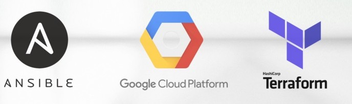
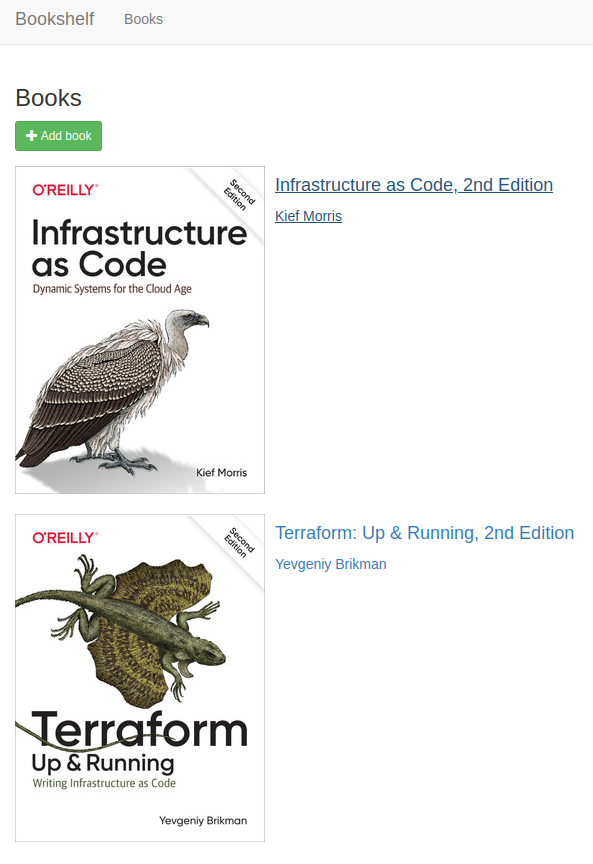
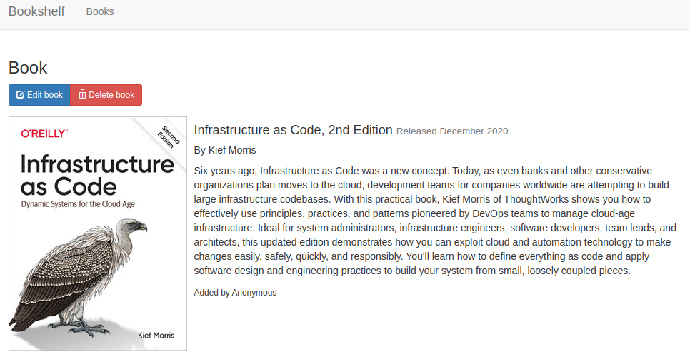

# Automation deploying with Bash, Terraform and Ansible on Google Cloud Platform

## Project Description  
Deploying infrastructure in Google Cloud Platform for Bookshelf application. The application is based on the Flask framework and written using Python language.
+ Using the gcloud commands in a bash script will create a project, link a payment account, create a cloud storage for a Terraform remote state file, activate the Google API, create a terraform-sa service account, export credential.json to env, create a Google Source Repository, submit source code to Infra repository, InstanceConfig repository, bookshelfApp repository.
+ Deploying Google GCP Virtual Network, Subnet, SQL Server, with Instance Template, Instance Group Management, Healthcheck, Cloud Nat, Load Balancer by Terraform. 
+ The Ansible will install all requirements, Cloud SQL Proxy from Google Cloud, OPS Monitoring Agent by Google and run Bookshelf application.

## Pre-requisite
+ Install Terraform on the local machine https://www.terraform.io/downloads.html
+ Create an free Google Cloud platform account (GCP) at URL https://console.cloud.google.com/
+ On your local machine, install Google Cloud SDK (recommended for debugging purpose) URL https://cloud.google.com/sdk
+ How to install Google Cloud SDK - https://cloud.google.com/sdk/docs/downloads-versioned-archives

## How to Execute
+ Perform the Git clone
+ ```cd bookshelf-gcp-ansible/```
+ Create the terraform.tfvars file in ```Source/Infra``` directory with variables. As example:

```
bookshelf-gcp-ansible/scripts/Infra$ cat terraform.tfvars
orchestration       = "tf"
gcp_region          = "europe-west1"
gcp_zone            = "europe-west1-b"
auto_create_subnet  = false
name                = "bookshelf"
vpc_name            = "bookshelf"
vpc_ingres_rules    = ["ssh", "http-8080", "http-80"]
private_ip_access   = true
ingres_source_range = ["0.0.0.0/0"]
ip_cidr_range       = "10.24.5.0/24"
bucket_prefix       = "app"
bucket_name         = "bookshelf"
```
+ Go to ```script``` directory. This directory contains 2 scripts: startProject.sh and shutdownProject.sh
+ Edit file startupProject.sh, set value in variable TF_VAR_project_id and TF_VAR_user_pass. As example:
```
export TF_VAR_project_id=gcp-2022-bookshelf-ianikeiev1
export TF_VAR_user_pass=bookshelf-pass #Password for database
```
+ Execute script startProject.sh
+ After complite your can see:
```
Apply complete! Resources: 37 added, 0 changed, 0 destroyed.

Outputs:

bookshelf_URL = "http://xxx.xxx.xxx.xxx"
```
+ Please wait 3-5 minutes while all resources staring and go to link
+ After that you cat add your books in bookshelf App




+ For stop project, you need execute next command:
```
bookshelf-gcp-ansible/scripts/Infra$ terraform destroy -auto-approve
...
...
...
module.vpc.google_compute_network.vpc_network[0]: Still destroying... [id=projects/gcp-2022-bookshelf-ianikeiev1/global/networks/bookshelf-vpc-tf, 20s elapsed]
module.vpc.google_compute_network.vpc_network[0]: Destruction complete after 22s

Destroy complete! Resources: 37 destroyed.
bookshelf-gcp-ansible/scripts/Infra$ cd ..
bookshelf-gcp-ansible/scripts$ ./shutdownProject.sh 
```